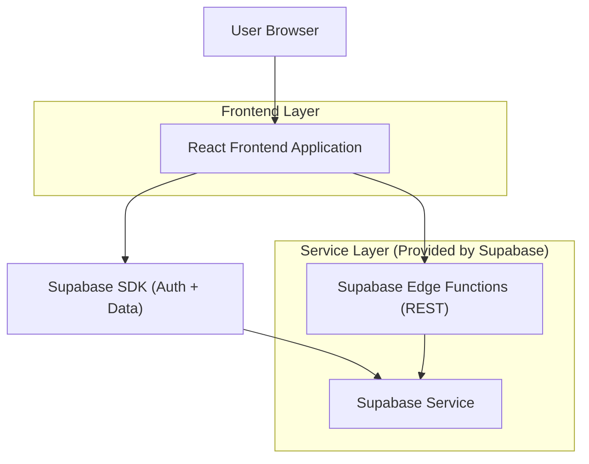
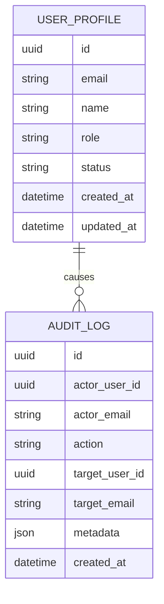

## 1.Architecture design


## 2.Technology Description
- Frontend: React@18 + vite + tailwindcss@3
- Backend: Supabase (PostgreSQL + Auth + RLS) + Supabase Edge Functions (Deno) para endpoints REST administrativos (operações que exigem credenciais privilegiadas)
- Testes:
  - Frontend: Vitest + React Testing Library + MSW (mock de API)
  - Backend (Edge Functions): Deno test (ou equivalente suportado no ambiente das funções)

## 3.Route definitions
| Route | Purpose |
|-------|---------|
| /login | Autenticar usuário e iniciar sessão |
| /admin/usuarios | CRUD de usuários com filtros/busca/paginação, gestão de papéis e auditoria |

## 4.API definitions (If it includes backend services)
### 4.1 Tipos compartilhados (TypeScript)
```ts
export type Role = 'operator' | 'admin' | 'superadmin'
export type UserStatus = 'active' | 'disabled'

export type UserSummary = {
  id: string
  name: string | null
  email: string
  role: Role
  status: UserStatus
  createdAt: string
}

export type AuditAction =
  | 'user.create'
  | 'user.update'
  | 'user.disable'
  | 'user.enable'
  | 'user.role.change'

export type AuditLogItem = {
  id: string
  actorUserId: string
  actorEmail: string
  action: AuditAction
  targetUserId: string | null
  targetEmail: string | null
  metadata: Record<string, unknown>
  createdAt: string
}
```

### 4.2 Core API (REST)
Autenticação: `Authorization: Bearer <supabase_jwt>` (token do usuário logado). Regras de autorização por papel devem ser reforçadas no servidor.

**Listar usuários (paginação/filtros/busca)**
```
GET /api/admin/users?search=&role=&status=&page=&pageSize=
```

**Criar usuário**
```
POST /api/admin/users
```
Request (exemplo):
```json
{ "email": "novo@empresa.com", "name": "Novo", "role": "operator" }
```

**Buscar usuário**
```
GET /api/admin/users/:id
```

**Atualizar usuário (dados e/ou papel e/ou status)**
```
PATCH /api/admin/users/:id
```
Request (exemplo):
```json
{ "name": "Nome Atualizado", "role": "admin", "status": "active" }
```

**Desativar usuário (soft delete)**
```
DELETE /api/admin/users/:id
```

**Listar logs de auditoria**
```
GET /api/admin/audit-logs?actor=&action=&target=&dateFrom=&dateTo=&page=&pageSize=
```

Regras essenciais de permissão (server-side):
- operator: somente leitura (lista/detalhe/logs conforme política definida)
- admin: pode criar/editar/desativar/reativar e promover até `admin` (não cria/remover superadmin)
- superadmin: acesso total
- proteção: impedir usuário de desativar a si mesmo; impedir rebaixar último superadmin (se aplicável)

Requisitos de testes para API (mínimo):
- deve paginar corretamente (page/pageSize) e retornar total/hasMore (ou equivalente)
- deve aplicar filtros (role/status) e busca (nome/email) de forma combinável
- deve bloquear ações proibidas por papel (matriz de permissões)
- deve escrever audit log para create/update/disable/enable/role.change com actor/target

## 6.Data model(if applicable)
### 6.1 Data model definition


### 6.2 Data Definition Language
User Profiles (user_profiles)
```sql
CREATE TABLE user_profiles (
  id UUID PRIMARY KEY,
  email TEXT NOT NULL,
  name TEXT,
  role TEXT NOT NULL CHECK (role IN ('operator','admin','superadmin')),
  status TEXT NOT NULL DEFAULT 'active' CHECK (status IN ('active','disabled')),
  created_at TIMESTAMPTZ NOT NULL DEFAULT NOW(),
  updated_at TIMESTAMPTZ NOT NULL DEFAULT NOW()
);

CREATE INDEX idx_user_profiles_email ON user_profiles (email);
CREATE INDEX idx_user_profiles_role_status ON user_profiles (role, status);

-- Recomenda-se habilitar RLS e políticas por role (JWT claims) para leituras.
ALTER TABLE user_profiles ENABLE ROW LEVEL SECURITY;

REVOKE ALL ON user_profiles FROM anon;
GRANT SELECT ON user_profiles TO authenticated;
```

Audit Logs (audit_logs)
```sql
CREATE TABLE audit_logs (
  id UUID PRIMARY KEY DEFAULT gen_random_uuid(),
  actor_user_id UUID NOT NULL,
  actor_email TEXT NOT NULL,
  action TEXT NOT NULL,
  target_user_id UUID,
  target_email TEXT,
  metadata JSONB NOT NULL DEFAULT '{}'::jsonb,
  created_at TIMESTAMPTZ NOT NULL DEFAULT NOW()
);

CREATE INDEX idx_audit_logs_created_at ON audit_logs (created_at DESC);
CREATE INDEX idx_audit_logs_actor ON audit_logs (actor_user_id, created_at DESC);
CREATE INDEX idx_audit_logs_action ON audit_logs (action, created_at DESC);

ALTER TABLE audit_logs ENABLE ROW LEVEL SECURITY;

REVOKE ALL ON audit_logs FROM anon;
GRANT SELECT ON audit