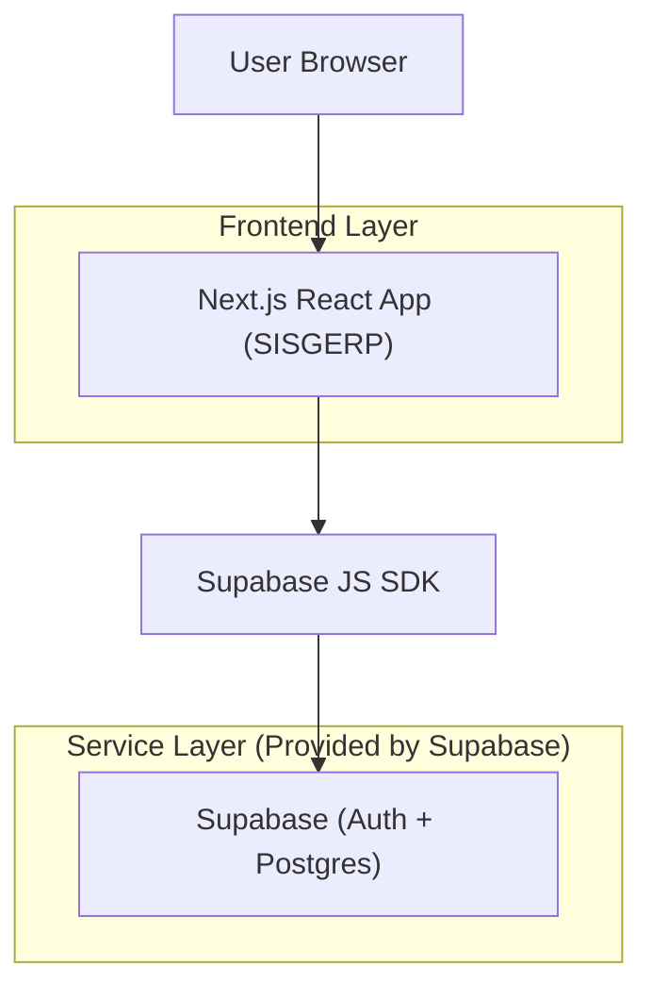
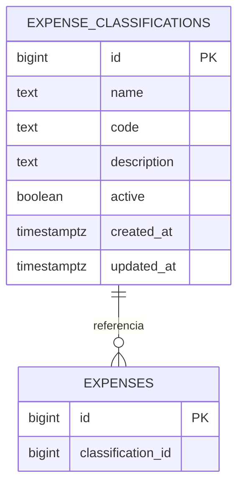

## 1.Architecture design


## 2.Technology Description
- Frontend: Next.js@16 (App Router) + React@19 + TypeScript@5 + tailwindcss@4 + shadcn/ui (Radix) + lucide-react
- Form/Validation: react-hook-form + zod + @hookform/resolvers
- Backend: Supabase (Auth + PostgreSQL) via @supabase/supabase-js

## 3.Route definitions
| Route | Purpose |
|-------|---------|
| /login | Autenticação do usuário e início de sessão |
| /dashboard | Entrada do app (pós-login) e navegação principal |
| /classificacao-despesas | CRUD de Classificação de Despesas (busca/filtros + modal de criação/edição) |

## 6.Data model(if applicable)

### 6.1 Data model definition


### 6.2 Data Definition Language
Expense classifications (expense_classifications)
```
CREATE TABLE public.expense_classifications (
  id bigint GENERATED BY DEFAULT AS IDENTITY PRIMARY KEY,
  name text NOT NULL,
  code text UNIQUE,
  description text,
  active boolean DEFAULT true,
  created_at timestamp with time zone DEFAULT now(),
  updated_at timestamp with time zone DEFAULT now()
);

-- Permissões (padrão Supabase)
GRANT SELECT