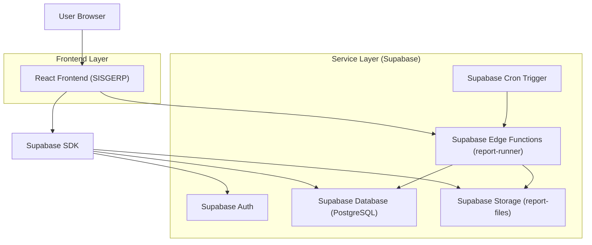
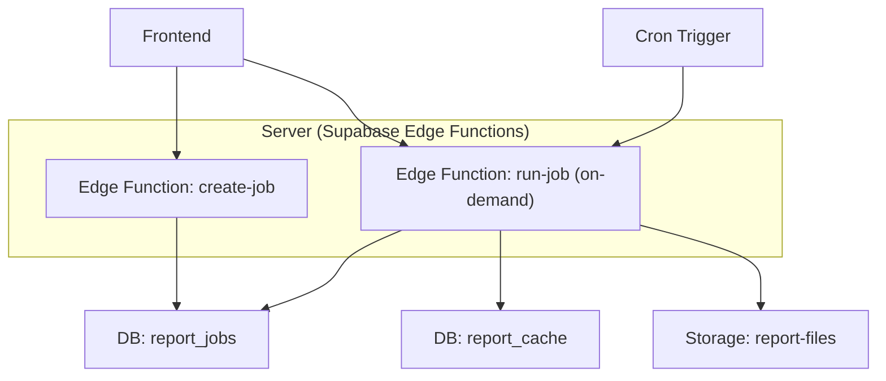
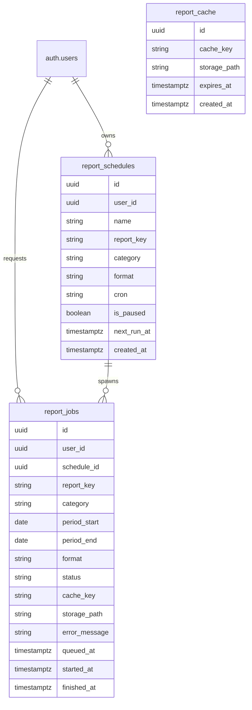

## 1.Architecture design


## 2.Technology Description
- Frontend: React@18 + TypeScript + vite + (UI do projeto)
- Backend: Supabase (Auth + PostgreSQL + Storage + Edge Functions)

## 3.Route definitions
| Route | Purpose |
|-------|---------|
| /relatorios | Central de relatórios (catálogo, filtros, exportações e downloads) |
| /relatorios/agendamentos | Gerir agendamentos recorrentes |
| /relatorios/execucoes/:id | Ver detalhes/status e baixar artefatos |

## 4.API definitions
### 4.1 Tipos principais (compartilhados)
```ts
type ReportFormat = 'PDF' | 'XLSX' | 'CSV'

type ReportJobStatus = 'QUEUED' | 'RUNNING' | 'READY' | 'FAILED'

type CreateReportJobRequest = {
  reportKey: string
  category: string
  periodStart: string // ISO
  periodEnd: string   // ISO
  format: ReportFormat
  useCache: boolean
}
```

### 4.2 Edge Functions
`POST /functions/v1/report-runner/create-job`
- Cria `report_jobs` com parâmetros e retorna `jobId`.

`POST /functions/v1/report-runner/run-job`
- Executa um job (chamado internamente/cron), gera arquivo, grava no Storage, atualiza status.

`POST /functions/v1/report-runner/cleanup-cache`
- Remove entradas expiradas de cache e arquivos órfãos (rotina periódica).

## 5.Server architecture diagram


## 6.Data model
### 6.1 Data model definition


### 6.2 Data Definition Language
```sql
-- Tabela de agendamentos
CREATE TABLE report_schedules (
  id UUID PRIMARY KEY DEFAULT gen_random_uuid(),
  user_id UUID NOT NULL,
  name TEXT NOT NULL,
  report_key TEXT NOT NULL,
  category TEXT NOT NULL,
  format TEXT NOT NULL CHECK (format IN ('PDF','XLSX','CSV')),
  cron TEXT NOT NULL,
  is_paused BOOLEAN NOT NULL DEFAULT FALSE,
  next_run_at TIMESTAMPTZ,
  created_at TIMESTAMPTZ NOT NULL DEFAULT NOW()
);
CREATE INDEX idx_report_schedules_user_id ON report_schedules(user_id);
CREATE INDEX idx_report_schedules_next_run ON report_schedules(next_run_at);

-- Execuções (jobs)
CREATE TABLE report_jobs (
  id UUID PRIMARY KEY DEFAULT gen_random_uuid(),
  user_id UUID NOT NULL,
  schedule_id UUID,
  report_key TEXT NOT NULL,
  category TEXT NOT NULL,
  period_start DATE NOT NULL,
  period_end DATE NOT NULL,
  format TEXT NOT NULL CHECK (format IN ('PDF','XLSX','CSV')),
  status TEXT NOT NULL CHECK (status IN ('QUEUED','RUNNING','READY','FAILED')),
  cache_key TEXT,
  storage_path TEXT,
  error_message TEXT,
  queued_at TIMESTAMPTZ NOT NULL DEFAULT NOW(),
  started_at TIMESTAMPTZ,
  finished_at TIMESTAMPTZ
);
CREATE INDEX idx_report_jobs_user_id ON report_jobs(user_id);
CREATE INDEX idx_report_jobs_status ON report_jobs(status);
CREATE INDEX idx_report_jobs_period ON report_jobs(period_start, period_end);
CREATE INDEX idx_report_jobs_cache_key ON report_jobs(cache_key);

-- Cache de relatórios (por hash dos parâmetros)
CREATE TABLE report_cache (
  id UUID PRIMARY KEY DEFAULT gen_random_uuid(),
  cache_key TEXT UNIQUE NOT NULL,
  storage_path TEXT NOT NULL,
  expires_at TIMESTAMPTZ NOT NULL,
  created_at TIMESTAMPTZ NOT NULL DEFAULT NOW()
);
CREATE INDEX idx_report_cache_expires_at ON report_cache(expires_at);

-- Segurança (diretriz)
-- 1) Ativar RLS nas tabelas e criar policies por user_id (dono) e papel admin.
-- 2) Storage bucket "report-files" com acesso privado; downloads via URL assinada (expirável).
-- 3) Edge Functions validam sessão (JWT), checam permissões e sanitizam error_message.

-- Permissões (base)
GRANT ALL PRIVILEGES ON report_schedules TO authenticated;
GRANT ALL PRIVILEGES ON report_jobs TO authenticated;
GRANT ALL PRIVILEGES ON report_cache