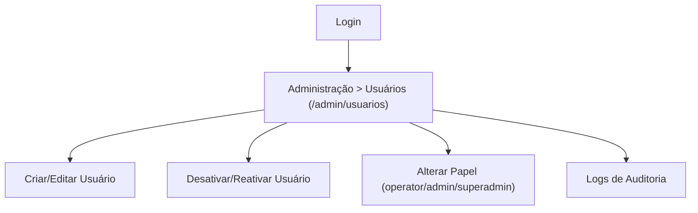

## 1. Product Overview
Módulo administrativo em **/admin/usuarios** para gerenciar usuários via CRUD com busca/filtros/paginação, controle de permissões por nível e logs de auditoria.
Focado em uso interno (equipe de operação e admins) com rastreabilidade e segurança.

## 2. Core Features

### 2.1 User Roles
| Role | Registration Method | Core Permissions |
|------|---------------------|------------------|
| Operator | Usuário já existente com papel atribuído por Admin/Superadmin | Acessar lista de usuários; visualizar detalhes; sem alterar permissões críticas (conforme regras abaixo) |
| Admin | Promoção por Superadmin | Criar/editar/desativar usuários; atribuir papel até **operator/admin**; visualizar logs |
| Superadmin | Bootstrap inicial / promoção controlada | Acesso total; atribuir/remover qualquer papel (inclui **superadmin**); ver e exportar logs |

### 2.2 Feature Module
1. **Login**: autenticação; redirecionamento pós-login; bloqueio de acesso não autorizado.
2. **Administração > Usuários (/admin/usuarios)**: listagem com busca/filtros/paginação; criar/editar/desativar; controle de permissões; painel de auditoria.

### 2.3 Page Details
| Page Name | Module Name | Feature description |
|-----------|-------------|---------------------|
| Login | Autenticação | Entrar com credenciais; manter sessão; redirecionar para /admin/usuarios quando autorizado; exibir erro de login. |
| /admin/usuarios | Guarda de acesso | Validar sessão e papel (operator/admin/superadmin); bloquear/ocultar ações sem permissão; exibir estado “sem permissão”. |
| /admin/usuarios | Lista de usuários | Listar usuários em tabela (nome, email, papel, status, criado em); ordenar básico; exibir estados loading/empty/error. |
| /admin/usuarios | Busca, filtros e paginação | Buscar por nome/email; filtrar por papel e status; paginar com page/pageSize; manter filtros na URL; limpar filtros. |
| /admin/usuarios | CRUD (criar/editar) | Criar usuário (dados mínimos e papel inicial); editar dados; validar campos; exibir confirmação e feedback de erro. |
| /admin/usuarios | Desativar/reativar (em vez de exclusão física) | Desativar usuário com confirmação; reativar; impedir desativar a si mesmo (regra). |
| /admin/usuarios | Controle de permissões por nível | Alterar papel conforme regras: operator não promove ninguém; admin promove até admin; superadmin promove qualquer; registrar justificativa opcional (regra). |
| /admin/usuarios | Logs de auditoria | Registrar eventos (criou/editou/desativou/trocou papel/login falho se disponível); listar logs com filtros (ator, ação, período, alvo); visualizar detalhes do evento. |
| /admin/usuarios | Qualidade e testes (requisito) | Garantir testes automatizados mínimos para UI crítica e para endpoints REST (CRUD, permissões, auditoria, paginação/filtros/busca). |

## 3. Core Process
**Operator Flow**: faz login → acessa /admin/usuarios → usa busca/filtros/paginação → visualiza detalhes e auditoria (somente leitura) → não consegue criar/desativar/alterar papel.

**Admin Flow**: faz login → acessa /admin/usuarios → cria/edita/desativa/reativa usuários → altera papel até admin → consulta auditoria para rastrear mudanças.

**Superadmin Flow**: faz login → acessa /admin/usuarios → executa todas as ações, incluindo promover/rebaixar superadmin → audita eventos e realiza revisões.

