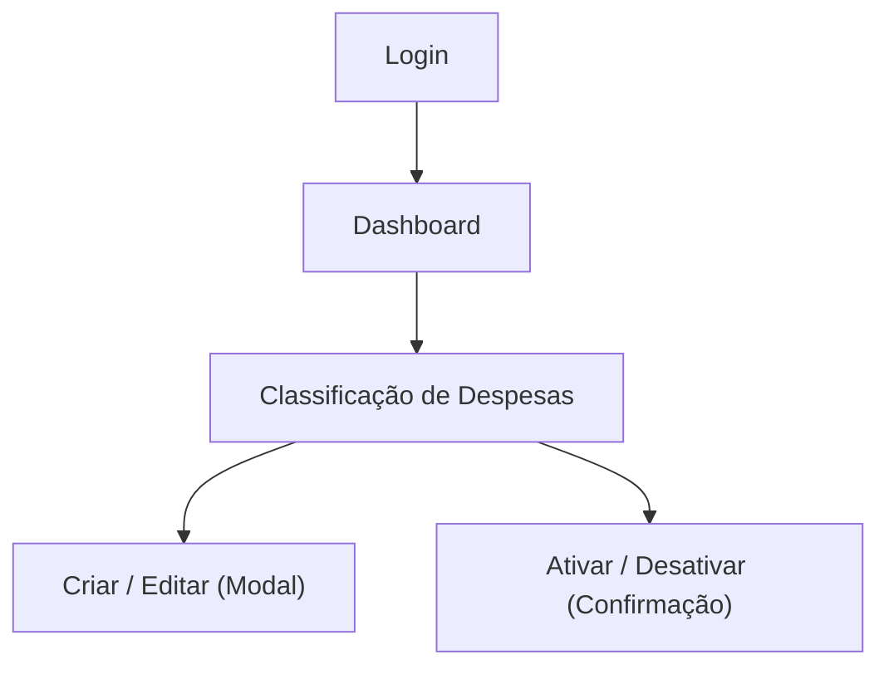

## 1. Product Overview
Módulo em **/classificacao-despesas** para manter o cadastro de classificações utilizadas no lançamento e na análise de despesas.
Entregará CRUD completo com formulário validado e listagem com busca/filtros, seguindo o padrão visual do SISGERP.

## 2. Core Features

### 2.1 User Roles
| Role | Registration Method | Core Permissions |
|------|---------------------|------------------|
| Usuário autenticado | Login no SISGERP | Acessar o módulo; listar; buscar/filtrar; criar; editar; ativar/desativar classificações |

### 2.2 Feature Module
1. **Login**: autenticação; controle de sessão; redirecionamento para o app.
2. **Classificação de Despesas**: listagem com busca/filtros; criar/editar com validação; ativar/desativar.

### 2.3 Page Details
| Page Name | Module Name | Feature description |
|-----------|-------------|---------------------|
| Login | Autenticação | Entrar com credenciais; manter sessão; redirecionar para /dashboard (ou última rota); exibir erro de login. |
| Classificação de Despesas | Guarda de acesso | Validar sessão; redirecionar para /login quando não autenticado; exibir estados loading/empty/error. |
| Classificação de Despesas | Busca e filtros | Buscar por **nome e/ou código**; filtrar por **status** (ativos/inativos); limpar filtros; manter estado de filtros ao atualizar listagem. |
| Classificação de Despesas | Listagem | Listar classificações em tabela (código, nome, status); exibir contagem/estado vazio; ações por linha. |
| Classificação de Despesas | CRUD (criar/editar) | Abrir modal de inclusão/edição; validar campos antes de salvar; salvar e atualizar listagem; exibir feedback de sucesso/erro. |
| Classificação de Despesas | Ativar/desativar | Desativar com confirmação; permitir reativar; impedir desativar quando regras de integridade impedirem (ex.: se adotado no SISGERP). |

## 3. Core Process
**Fluxo principal (Usuário autenticado)**: faz login → abre “Classificação de Despesas” no menu → usa busca/filtros → cria uma nova classificação ou edita uma existente → ativa/desativa uma classificação conforme necessidade.

