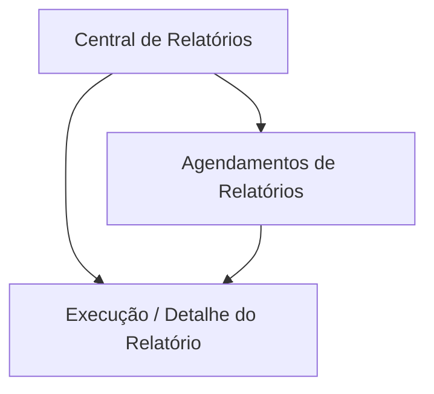

## 1. Product Overview
Módulo de Relatórios do SISGERP para consultar, exportar e agendar relatórios com segurança.
Atende usuários internos que precisam de extrações em PDF/XLSX/CSV com filtros e execução assíncrona.

## 2. Core Features

### 2.1 User Roles
| Papel | Método de cadastro | Permissões principais |
|------|---------------------|-----------------------|
| Usuário autenticado | Login existente do SISGERP | Visualizar relatórios permitidos, aplicar filtros, solicitar exportação, baixar arquivos, criar/gerenciar seus agendamentos |
| Administrador | Atribuição por perfil interno | Gerir permissões/categorias de relatório e visualizar execuções (auditoria) |

### 2.2 Feature Module
Nosso módulo de Relatórios consiste nas seguintes páginas:
1. **Central de Relatórios**: catálogo por categoria, filtros por período, geração/exportação, status e downloads.
2. **Agendamentos de Relatórios**: criação/edição de recorrência, parametrização (período/categoria), destinos e histórico resumido.
3. **Execução / Detalhe do Relatório**: detalhes da execução, logs básicos, reprocessar, download seguro de artefatos.

### 2.3 Page Details
| Page Name | Module Name | Feature description |
|-----------|-------------|------------------|
| Central de Relatórios | Catálogo por categoria | Listar relatórios disponíveis por categoria e permitir selecionar um relatório-base |
| Central de Relatórios | Filtros | Filtrar por período (intervalo) e categoria; validar datas e parâmetros obrigatórios |
| Central de Relatórios | Solicitar exportação | Criar solicitação assíncrona de geração (PDF/XLSX/CSV) com parâmetros e prioridade padrão |
| Central de Relatórios | Progresso e resultados | Exibir status (fila/processando/pronto/erro), permitir atualizar e abrir detalhe da execução |
| Central de Relatórios | Download seguro | Baixar arquivo gerado via link assinado/expirável e registrar auditoria |
| Agendamentos de Relatórios | CRUD de agendamento | Criar/editar/pausar/excluir agendamentos recorrentes com nome, relatório, formato e parâmetros |
| Agendamentos de Relatórios | Recorrência | Definir recorrência (ex.: diário/semanal/mensal) e janela de período usada na execução (ex.: último mês) |
| Agendamentos de Relatórios | Execução automática | Disparar execuções no horário configurado e registrar cada execução com rastreabilidade |
| Agendamentos de Relatórios | Visibilidade e segurança | Restringir agendamentos ao dono e/ou a perfis autorizados (admin) |
| Execução / Detalhe do Relatório | Resumo da execução | Mostrar parâmetros, formato, solicitante, timestamps, status, duração e tamanho do arquivo |
| Execução / Detalhe do Relatório | Cache/otimização | Indicar quando resultado veio de cache e permitir reprocessar ignorando cache (se permitido) |
| Execução / Detalhe do Relatório | Tratamento de falhas | Exibir mensagem de erro sanitizada e permitir nova tentativa quando aplicável |

## 3. Core Process
**Fluxo (Usuário autenticado):** você entra na Central de Relatórios, escolhe a categoria/relatório, define período e formato (PDF/XLSX/CSV) e solicita a geração. Eu coloco a execução em fila assíncrona, você acompanha o status e baixa o arquivo quando estiver pronto (com link seguro e expirável).

**Fluxo (Agendamento):** você cria um agendamento com recorrência e parâmetros. Eu executo automaticamente em background; cada execução aparece no histórico e os arquivos ficam disponíveis para download conforme suas permissões.

**Fluxo (Admin):** você ajusta permissões/categorias de relatórios e pode inspecionar execuções para auditoria.

