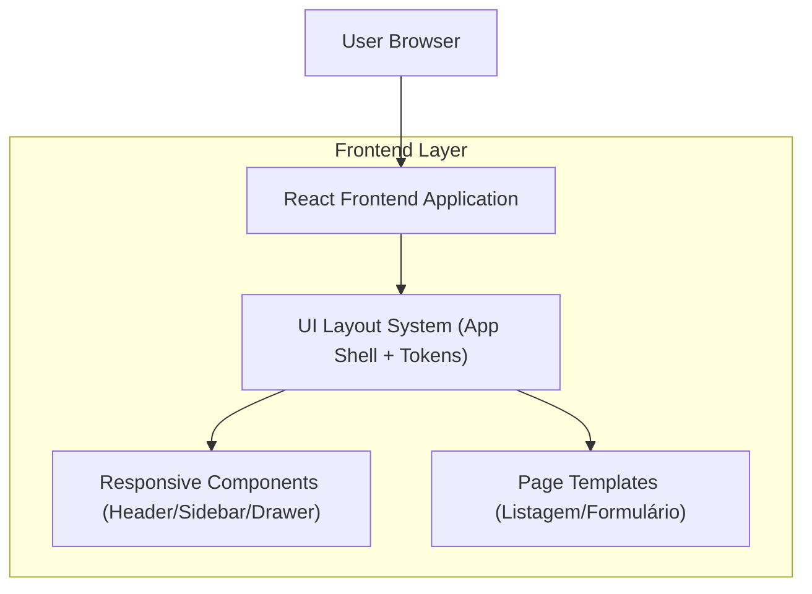

## 1.Architecture design

## 2.Technology Description
- Frontend: React@18 + TypeScript (stack do projeto) + React Router (rotas) + CSS (Tailwind ou CSS Modules conforme padrão do SISGERP)
- Backend: None (escopo apenas de UI)

## 3.Route definitions
| Route | Purpose |
|-------|---------|
| / | Entrada do sistema com layout global aplicado |
| /:modulo | Página de listagem (padrão) para um módulo (ex.: cadastros/consultas) |
| /:modulo/:id | Página de detalhe/formulário (padrão) para criar/editar |

## 4.API definitions (If it includes backend services)
N/A

## 5.Server architecture diagram (If it includes backend services)
N/A

## 6.Data model(if applicable)
N/A

---
### Diretrizes de implementação (UI)
- Sistema de layout: centralizar regras de breakpoints (320/768/1024/1440) e tokens (spacing, typography, grid) em um único local para reduzir inconsistência.
- Menu responsivo:
  - Mobile (320/768): Drawer com overlay, foco preso no drawer (focus trap), fechamento por ESC e clique no overlay.
  - Desktop (>=1024): Sidebar persistente com opção de recolher (ícones + tooltips).
- Acessibilidade:
  - Links e botões com nomes acessíveis; estados de expandido/recolhido (aria-expanded/aria-controls).
  - “Skip to content”, foco visível e ordem de tabulação consistente.
- Performance:
  - Preferir CSS (media queries/container queries) para layout ao invés de lógica JS.
  - Componentizar AppShell para evitar rerender da árvore inteira ao abrir/fechar menu.
  - Lazy-load de páginas/rotas quando aplicável.
