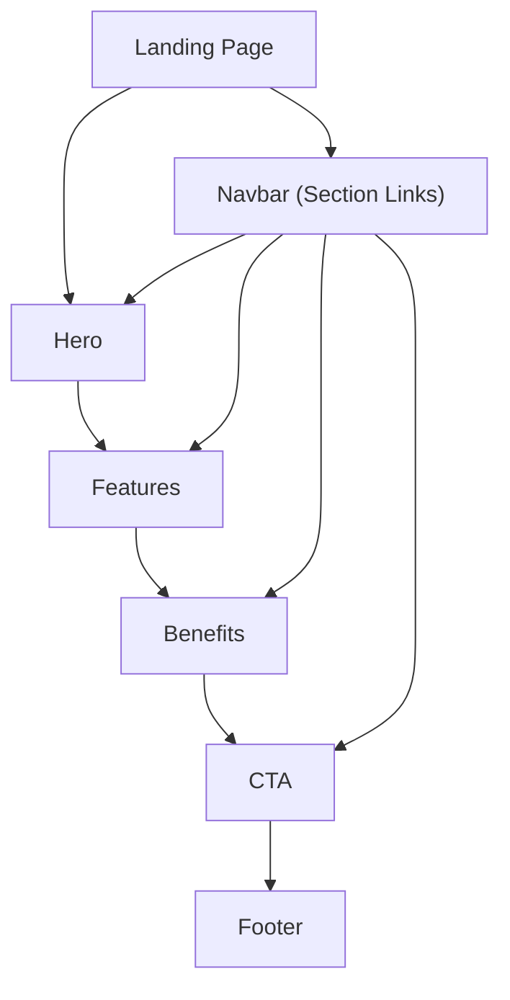

## 1. Product Overview
SISGERP Landing Page is a single-page marketing site that introduces SISGERP and drives visitors to a primary call-to-action.
It focuses on clear messaging, a distinctive angled-edge hero, and fully responsive sections.

## 2. Core Features

### 2.1 User Roles
Not required (public marketing page).

### 2.2 Feature Module
Our landing page requirements consist of the following main pages:
1. **Landing page**: navbar with section links, hero with angled edge, features, benefits, CTA, footer.

### 2.3 Page Details
| Page Name | Module Name | Feature description |
|-----------|-------------|---------------------|
| Landing page | Navbar | Display brand area and section links; highlight active section on scroll (basic); collapse into mobile menu for small screens. |
| Landing page | Hero (angled edge) | Present headline, short value proposition, primary/secondary CTA buttons; render angled bottom edge (decorative) without affecting readability. |
| Landing page | Features section | List key features in a responsive card grid; show an icon (Lucide) + title + 1–2 lines per feature. |
| Landing page | Benefits section | Explain outcomes/benefits with concise bullets; support a split layout (text + supporting visual/illustration area). |
| Landing page | CTA section | Reinforce value and provide a prominent CTA button; support a short supporting line (trust/reassurance text). |
| Landing page | Footer | Show secondary navigation (section links), basic product/company text, and copyright. |
| Landing page | Responsiveness & accessibility | Ensure keyboard navigability, visible focus states, semantic headings, and responsive spacing/typography across breakpoints. |

## 3. Core Process
- Visitor flow: you land on the page, scan hero messaging, and choose either to click the primary CTA or scroll to learn more.
- Exploration flow: you use the navbar to jump to Features/Benefits/CTA sections; on mobile you open the menu and tap a section link.
- Conversion flow: you click the primary CTA (e.g., “Get started” / “Request a demo”) which routes to the intended destination defined by the product (placeholder link is acceptable in early draft).

