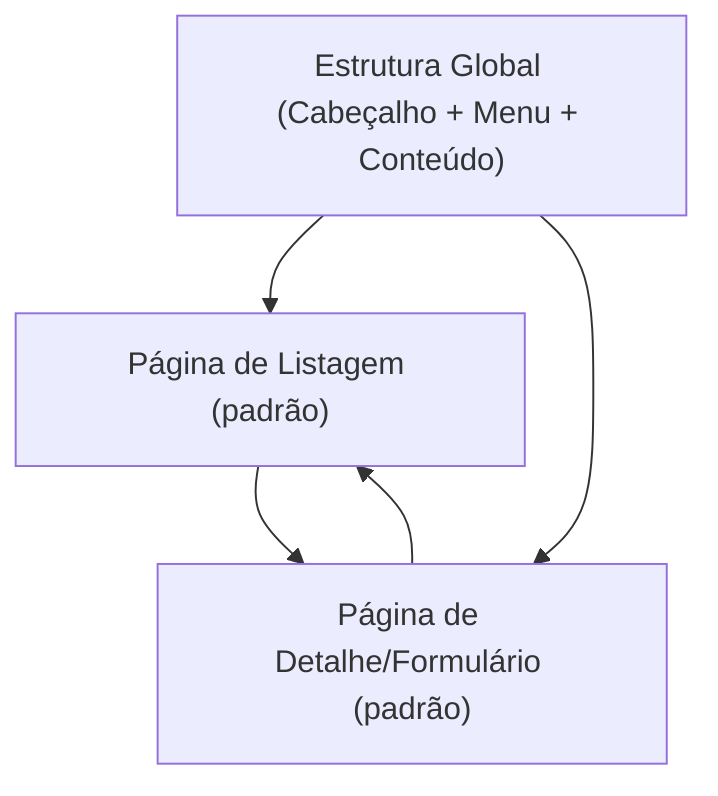

## 1. Product Overview
Tornar a UI do SISGERP totalmente responsiva em desktop e mobile, com navegação adaptável, mantendo acessibilidade e alta performance.
O foco é padronizar comportamento visual/interaction em breakpoints 320/768/1024/1440 para reduzir retrabalho e melhorar usabilidade.

## 2. Core Features

### 2.1 Feature Module
Nosso escopo de responsividade consiste nas seguintes páginas (padrões) do produto:
1. **Estrutura Global (Cabeçalho + Menu + Conteúdo)**: menu mobile adaptável, alternância de layout por breakpoint, atalhos de acessibilidade.
2. **Página de Listagem (padrão)**: tabela/lista responsiva, filtros adaptáveis, paginação e estados (vazio/erro/carregando) responsivos.
3. **Página de Detalhe/Formulário (padrão)**: formulário responsivo, validação e ações (salvar/cancelar) com layout adequado a cada breakpoint.

### 2.2 Page Details
| Page Name | Module Name | Feature description |
|-----------|-------------|------------------|
| Estrutura Global (Cabeçalho + Menu + Conteúdo) | Breakpoints | Aplicar comportamentos consistentes em 320/768/1024/1440 com rearranjo de navegação e densidade de informação. |
| Estrutura Global (Cabeçalho + Menu + Conteúdo) | Menu mobile adaptável | Exibir menu em drawer/modal no mobile (320/768) com abrir/fechar, overlay e bloqueio de scroll; manter menu lateral persistente no desktop (>=1024) com opção de recolher. |
| Estrutura Global (Cabeçalho + Menu + Conteúdo) | Acessibilidade base | Permitir navegação por teclado (Tab/Shift+Tab), foco visível, “pular para conteúdo”, rótulos/ARIA em botões do menu e estados de expansão, e suporte a leitores de tela. |
| Estrutura Global (Cabeçalho + Menu + Conteúdo) | Performance percebida | Minimizar reflows e renderizações desnecessárias em mudanças de breakpoint; garantir tempo de resposta consistente ao abrir/fechar menu e trocar rotas. |
| Página de Listagem (padrão) | Conteúdo responsivo | Exibir dados como tabela no desktop e como lista/cartões no mobile quando necessário, preservando leitura e ações principais. |
| Página de Listagem (padrão) | Filtros adaptáveis | Exibir filtros como barra lateral/painel no desktop e como painel colapsável (accordion/drawer) no mobile. |
| Página de Listagem (padrão) | Ações e paginação | Manter ações principais acessíveis (ex.: criar/editar) com alvos de toque adequados no mobile; paginação adaptada (compacta no mobile). |
| Página de Detalhe/Formulário (padrão) | Layout do formulário | Reorganizar campos em 1 coluna no mobile e múltiplas colunas no desktop; manter alinhamento, espaçamento e legibilidade consistentes. |
| Página de Detalhe/Formulário (padrão) | Barra de ações | Fixar (sticky) ações no mobile quando necessário (salvar/cancelar) sem cobrir conteúdo; manter ações alinhadas e previsíveis no desktop. |
| Página de Detalhe/Formulário (padrão) | Acessibilidade de formulários | Garantir labels vinculados, mensagens de erro claras e associadas ao campo, e ordem de tabulação lógica em todos os breakpoints. |

## 3. Core Process
### Fluxo principal (qualquer usuário)
1. Você acessa o sistema no desktop ou no mobile.
2. Você usa o menu:
   - No mobile (320/768), você abre o menu (drawer), escolhe uma seção e o menu fecha automaticamente ao navegar.
   - No desktop (1024/1440), o menu fica visível (com opção de recolher) e você navega entre páginas sem perder contexto.
3. Você interage com listagens (filtra, pagina, abre detalhe) e com formulários (edita e salva), com componentes ajustando layout sem quebrar conteúdo.
4. Você navega usando teclado e leitor de tela com foco sempre visível e ordem lógica.

