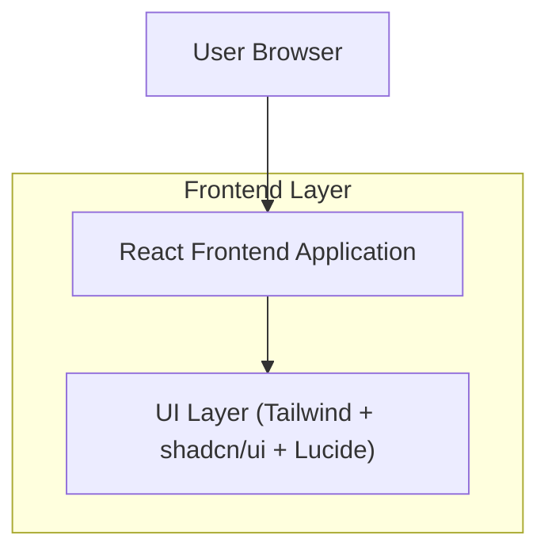

## 1.Architecture design

## 2.Technology Description
- Frontend: React@18 + TypeScript + Next.js (App Router)
- UI/Styling: tailwindcss@3 + shadcn/ui + lucide-react
- Backend: None (static marketing landing page)

## 3.Route definitions
| Route | Purpose |
|-------|---------|
| / | Landing page (navbar + hero with angled edge + features + benefits + CTA + footer) |

Notes:
- Section navigation uses hash anchors (e.g., /#features, /#benefits, /#cta) rather than separate routes.
